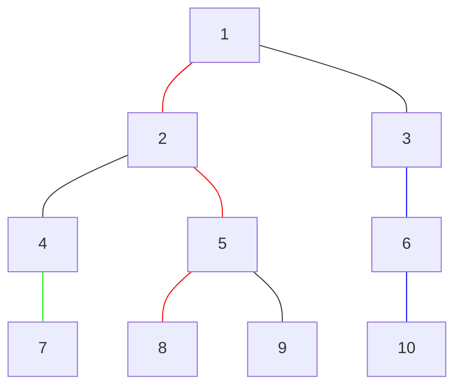
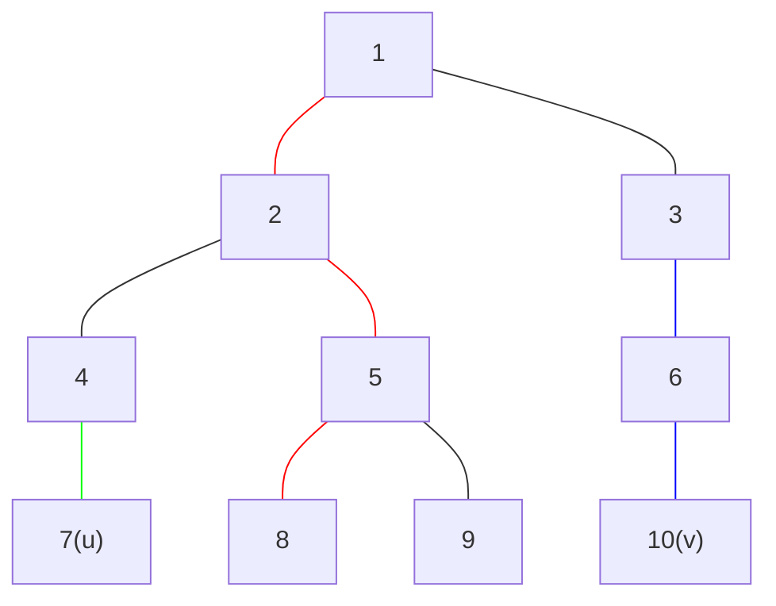
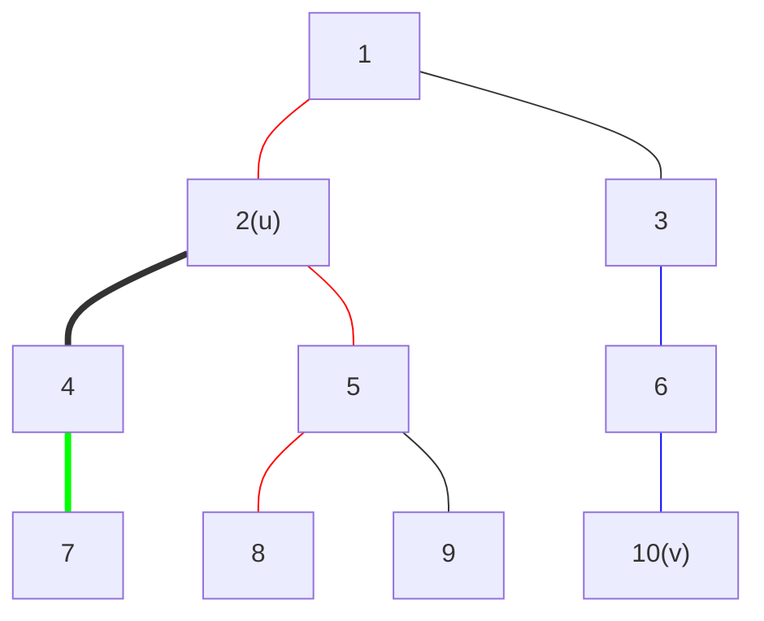
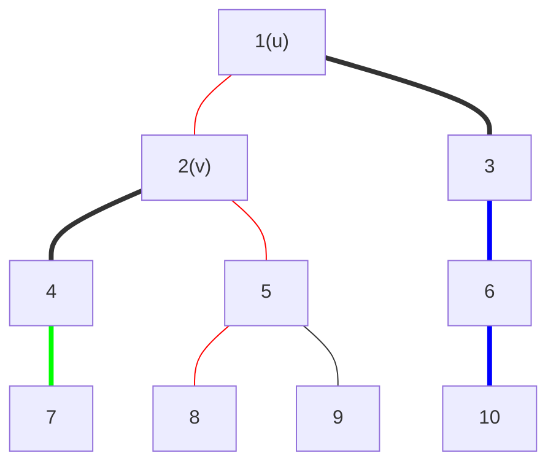

# 树链剖分解决什么问题

先看这样的一个问题：

给出一棵$n$个结点, 每个结点有点权, 要求支持:

`1 u v x` 将树上$u\rightarrow v$这条链的所有结点点权增加$x$
`2 u x` 将$u$的子树的所有结点的点权增加$x$
`3 u v` 询问$u\rightarrow v$这条链的所有结点点权和
`4 u` 询问$u$的子树的所有结点的点权和

$n,q\leq 1\times 10^5$

这个问题看起来很像[线段树](./ymoi集训-线段树.md)的题，不过这是在树上操作，所以我们要用树链剖分。

# 轻重链剖分

简称HLD(**H**eavy **L**ight **D**ecomposition)。

## 基本概念

先做出如下定义：

- $siz[i]$表示$i$结点的子树大小
- $dep[i]$表示$i$结点的深度(定义根的深度为1)
- $fa[i]$表示$i$结点的父结点编号

对于所有$v\in \{v|u\rightarrow v\}$，称$siz[v]$最大的为$u$的重儿子，边$u\rightarrow v$为重边。

除重边以外的边称为轻边。

再做出如下定义：

- $son[i]$表示$i$结点的重儿子编号
- $top[i]$表示$i$结点所在重链顶端结点的编号
- $id[i]$表示$i$结点按照重儿子优先顺序的dfs序号

例如：



|      | 1    | 2    | 3    | 4    | 5    | 6    | 7    | 8    | 9    | 10   |
| ---- | ---- | ---- | ---- | ---- | ---- | ---- | ---- | ---- | ---- | ---- |
| siz | 10   | 6    | 3    | 2    | 3    | 2    | 1    | 1    | 1    | 1    |
| dep | 1    | 2    | 2    | 3    | 3    | 3    | 4    | 4    | 4    | 4    |
| son | 2    | 5    | 6    | 7    | 8    | 10   | 7    | 8    | 9    | 10   |
| top | 1    | 1    | 3    | 4    | 1    | 3    | 4    | 1    | 9    | 3    |
| id  | 1 | 2    | 8    | 6    | 3    | 9    | 7    | 4    | 5    | 10   |

我们看id数组：

| 1                | 2                | 3                 | 4                  | 5                | 6                 | 7                  | 8                | 9    | 10                 |
| ---------------- | ---------------- | ----------------- | ------------------ | ---------------- | ----------------- | ------------------ | ---------------- | ---- | ------------------ |
| $\color{red}{1}$ | $\color{red}{2}$ | $\color{blue}{8}$ | $\color{green}{6}$ | $\color{red}{3}$ | $\color{blue}{9}$ | $\color{green}{7}$ | $\color{red}{4}$ | $5$  | $\color{blue}{10}$ |

**同一条重链上的节点，它们的$id$是连续的自然数；同一个子树上的节点，它们的$id$也是连续的自然数。**

既然已经连续了……上线段树。

## 子树查询/更新

```C++
int query_tree(int u){
    return query(1,1,n,id[u],id[u]+siz[u]-1);
}

void update_tree(int u,int val){
    update(1,1,n,id[u],id[u]+siz[u]-1,val);
}
```

## 链查询/更新

在研究链的问题之前，先要解决用树链剖分求解LCA的方法，如下：

- 直到$u$和$v$所在的重链相同之前：
  - 如果$top[u]$比$top[v]$更高，即深度更小，就交换$u$和$v$。
  - $u$跳到$top[u]$的父亲节点。
- $u$和$v$中深度较小的那一个就是所求LCA。

例如，求7和10的LCA：



$u$跳到$2$。覆盖树链$2\rightarrow 7$：



交换$u$和$v$，$u$跳到$1$，覆盖树链$1\rightarrow 10$：



最终覆盖树链$1\rightarrow 2$并返回$u$

代码：

```C++
int lca(int u,int v){
    while(top[u]!=top[v]){
        if(dep[top[u]]<dep[top[v]])swap(u,v);
        u=fa[top[u]];
    }
    return dep[u]<dep[v]?u:v;
}
```

用求LCA的方法，就可以进行线段树的查询和更新。在向上跳之前更新即可。这时所更新的链为$top[u]\rightarrow u$，这条链在线段树上所对应的区间为$[id[top[u]],id[u]]$。

当然，在最后不要忘记对$u\rightarrow v$这条链进行操作。

代码：

```C++
int query_path(int u,int v){
    int ans=0;
    while(top[u]!=top[v]){
        if(dep[top[u]]<dep[top[v]])swap(u,v);
        ans+=query(1,1,n,id[top[u]],id[u]);
        u=fa[top[u]];
    }
    if(dep[u]>dep[v])swap(u,v);
    ans+=query(1,1,n,id[u],id[v]);
    return ans;
}

void update_path(int u,int v,int val){
    while(top[u]!=top[v]){
        if(dep[top[u]]<dep[top[v]])swap(u,v);
        update(1,1,n,id[top[u]],id[u],val);
        u=fa[top[u]];
    }
    if(dep[u]>dep[v])swap(u,v);
    update(1,1,n,id[u],id[v],val);
}
```

以上就是轻重链剖分的基本操作。

模板：[hld.cpp](https://github.com/CrSjimo/brush-problem/blob/master/templates/hld.cpp)